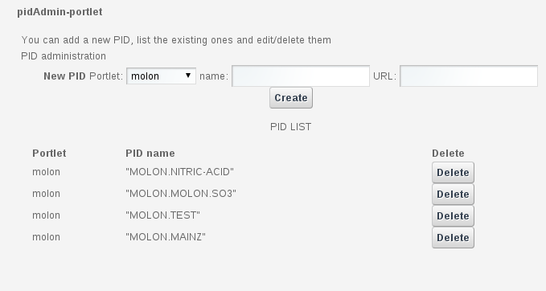

********
PIDADMIN
********

============
About
============

A persistent identifier (PID) is a long-lasting reference to a digital object—a single file or set of files. With this approach, references to the data are decoupled from its physical location, thus allowing a high degree of flexibility while ensuring that the information will always be accessible.  Catania Science Gateway is committed to this approach, allowing the usage of PIDs to specify the location of the input files of many of the integrated applications. Of course, the user can also employ it to identify the place where the output of a given execution has been stored.  pidAdmin is a very simple application devoted to manage these PIDs. It allows to create or delete PIDs corresponding to the different existing applications, greatly simplifying their management and making it accesible to any user of Catania Science Gateway.

============
Installation
============
To install the pidAdmin portlet the WAR file has to be deployed into the application server.

As soon as the portlet has been successfully deployed on the Science Gateway the administrator has to configure:

- the list of e-Infrastructures where the application can be executed;

- some additional application settings.

1.) To configure a generic e-Infrastructure, the following settings have to be provided:

**Enabled**: A true/false flag which enables or disable the generic e-Infrastructure;

**Infrastructure**: The acronym to reference the e-Infrastructure;

**VOName**: The VO for this e-Infrastructure;

**TopBDII**: The Top BDII for this e-Infrastructure;

**WMS Endpoint**: A list of WMS endpoint for this e-Infrastructure (max. 10);

**MyProxyServer**: The MyProxyServer for this e-Infrastructure;

**eTokenServer**: The eTokenServer for this e-Infrastructure;

**Port**: The eTokenServer port for this e-Infrastructure;

**Serial Number**: The MD5SUM of the robot certificate to be used for this e-Infrastructure;

**WebDAV**: The EMI-3 DPM Grid Storage Element, with WebDAV interface, to be used for this e-Infrastructure;

In the following figure is shown how the portlet has been configured to run simulation on the EUMEDGRID-Support e-Infrastructure.

.. image:: images/settings.jpg
   :align: center

2.) To configure the application, the following settings have to be provided:

**AppID**: The ApplicationID as registered in the UserTracking MySQL database (GridOperations table);

**Log Level**: The log level for the application (e.g.: *INFO* or *VERBOSE*);

**Metadata Host**: The Metadata hostname where download/upload digital-assets (e.g. *glibrary.ct.infn.it*);

**Software TAG**: The list of software tags requested by the application;

**SMTP Host**: The SMTP server used to send notification to users;

**Sender**: The FROM e-mail address to send notification messages about the jobs execution to users;

.. _CHAIN-REDS: https://science-gateway.chain-project.eu/
.. _gLibrary: https://glibrary.ct.infn.it/

In the figure below is shown how the application settings have been configured to run on the CHAIN-REDS_ Science Gateway.

.. image:: images/settings2.jpg
   :align: center

============
Usage
============

pidAdmin allows to manage PIDs. Using its very simple interface user can create, list and delete them. As PIDs can be related to different portlets, they can be chosen in the menu.

============
References
============

.. _1: http://agenda.ct.infn.it/event/1110/

* CHAIN-REDS Conference: *"Open Science at the Global Scale: Sharing e-Infrastructures, Sharing Knowledge, Sharing Progress"* – March 31, 2015 – Brussels, Belgium [1_];

============
Contributors
============
Please feel free to contact us any time if you have any questions or comments.

.. _Sci-Track: http://rdgroups.ciemat.es/web/sci-track/

:Authors:
 `Manuel RODRIGUEZ-PASCUAL <mailto:manuel.rodriguez@ciemat.es>`_ - CIEMAT Sci-Track

